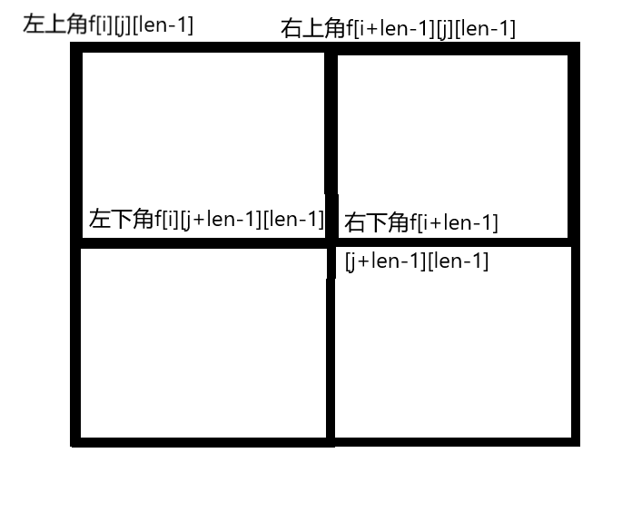

# st表

## st表的概念
- st表是一种静态的求最值的工具

## st表的实现
- [模板题](./作业代码/P3865%20【模板】ST%20表%20&%20RMQ%20问题.cpp)
- 这道题是模板，是最基础的st表的实现
- 步骤1: 初始化 lg[] 数组，用来快速计算 log()
- 步骤2: st表的计算 -> max(左区间,右区间)
- 步骤3: 计算区间最值 -> max([左坐标][长度],[右坐标-长度+1][长度])

---

## st表例题
1. [运用st表做其他运算](./作业代码/P1890%20gcd%20区间.cpp)

> 本题把模板中max替换成了gcd，说明st表也可以处理其他运算(异或)

2. [接上题](./作业代码/P1816%20忠诚.cpp)

> 把max替换成min

3. [批量求最值](./作业代码/P2251%20质量检测.cpp)

> 本题类似单调队列，滑动求值，只不过使用st表对整个列表求值

4. [在线处理](./作业代码/P1198%20%5BJSOI2008%5D%20最大数.cpp)

> 本题是在线处理，导入一个数据就求一次最值(状态计算)

5. [求差值](./作业代码/P2880%20%5BUSACO07JAN%5D%20Balanced%20Lineup%20G.cpp)

> 本题是求两个st表后求最值的差值(max(f)-min(f))

---

### 扩展 : 二位st表

[二位st表题目示例](./作业代码/P2216%20%5BHAOI2007%5D%20理想的正方形.cpp)

题目思路：开一个结构体在st表中分别存储最大|最小值 在利用图例中的方法做st表的计算
最后求出最值差

总结：要处理好四个正方形的坐标范围，且查询的时候也要求四个正方形的最值
